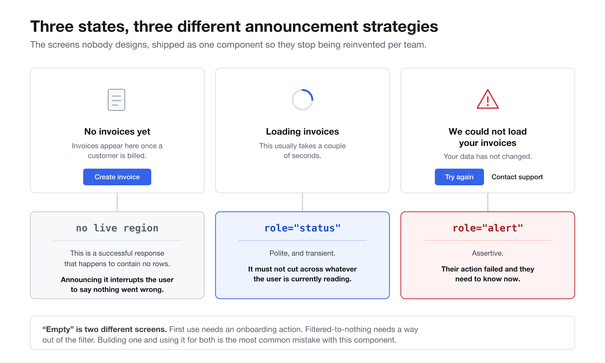
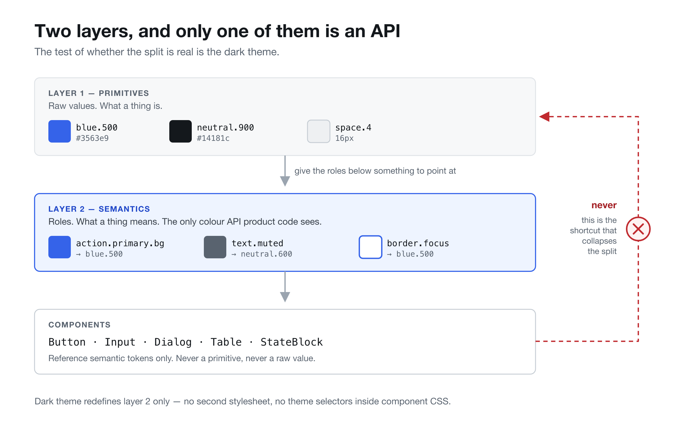
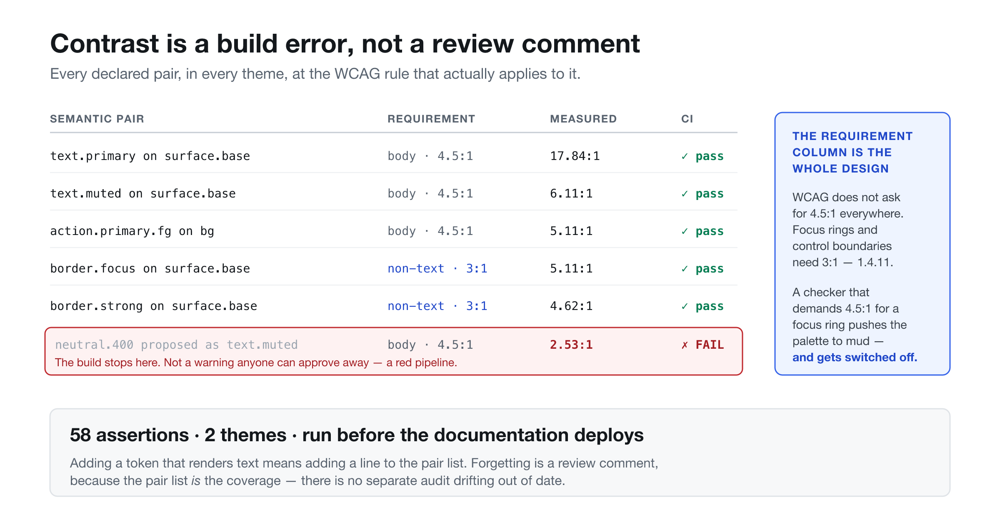
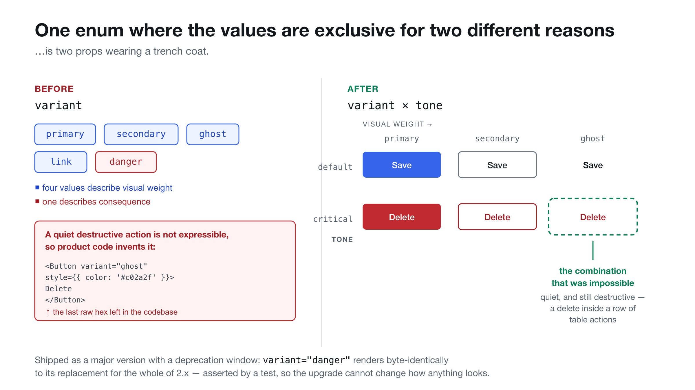

# @bighatpoland/ui

A small design system built to answer the question interviews actually ask:
**not "can you make a button", but "what did you decide, and what did it cost".**

Thirty-nine components in two layers — the everyday controls, and the frame they
sit in. Two token layers. WCAG AA enforced by a failing build rather than a
review comment. A deprecation carried from announcement to removal across two
major versions. Two whole-page templates. And a skill file that lets a coding
agent follow the system's rules instead of inventing its own.

**[Storybook →](https://bighatpoland.github.io/bighat-design-system/)**

[](https://github.com/bighatpoland/bighat-design-system/actions/workflows/ci.yml)
[](https://bighatpoland.github.io/bighat-design-system/)
[](#2-contrast-is-a-build-error)
[](./LICENSE)



---

## The four decisions

### 1. Two token layers, and only one of them is an API

Primitives (`blue-500`, `space-4`) say what a value _is_. Semantics
(`action.primary.hover`, `text.muted`, `border.focus`) say what it _means_.
Components may only touch the second layer.

This is the difference between a theme switch that works and one that needs a
find-and-replace. Dark mode here is a swap of the semantic layer alone —
`src/tokens/semantic.ts` is 150 lines and there is no second stylesheet.

The cost is real and worth naming: every new colour needs a _role_ before it
can be used, which means designers cannot hand over a hex and be done. That
friction is the feature.



### 2. Contrast is a build error

`src/tokens/semantic.ts` declares every foreground/background pair the system
promises to keep legible, along with the WCAG rule that actually applies to it —
4.5:1 for body text, 3:1 for large text and for non-text like focus rings and
control boundaries.

`src/tokens/contrast.test.ts` iterates that list across both themes. **58
assertions, run in CI before Storybook deploys.** A palette tweak that looks
better but drops `text.muted` to 4.3:1 turns the build red.

Two things this design gets right that a generic linter cannot:

- It knows a focus ring is non-text, so it does not demand an absurd 4.5:1 and
  push the palette to mud.
- Adding a token that renders text without declaring its pair is a review
  comment, not a silent gap — because the pair list _is_ the coverage.



### 3. The states nobody designs are a component

`StateBlock` covers empty, loading and error. It exists because those three
screens get reinvented by every team, with a different tone of voice each time
and none of them announced correctly:

| State     | Live region                | Why                                                               |
| --------- | -------------------------- | ----------------------------------------------------------------- |
| `loading` | `role="status"` — polite   | Transient. Must not cut across what the user is reading.          |
| `error`   | `role="alert"` — assertive | Their action failed. They need to know now.                       |
| `empty`   | none                       | A successful response with nothing in it. Announcing it is noise. |

`Table` does not own an empty state — it renders a `StateBlock` across its
columns. One vocabulary for "nothing here", whether the surface is a table, a
panel or a route.

It also distinguishes the two situations everyone collapses into one: _you have
no invoices yet_ needs an onboarding action; _no invoices match these filters_
needs a way out of the filter.

### 4. One breaking change, with the argument written down

`Button`'s `variant` prop was doing two jobs — four values described visual
weight, one (`danger`) described consequence. It held up until someone needed a
destructive action that was not the loudest thing on screen, and product code
filled with inline colour overrides.

2.0 split it into `variant` (weight) and `tone` (consequence). `variant="danger"`
kept rendering **byte-identically** through the whole of 2.x — asserted by a
test — while warning once in development. That is what let a team take the new
major on a Tuesday and do the rename whenever they got to it: the version bump
and the migration were two separate decisions.

3.0 closed the window and removed it. A deprecation that never ends is not a
deprecation; it is a second API you have quietly agreed to maintain forever.



Full reasoning, deprecation timeline and a scripted rename: **[MIGRATION.md](./MIGRATION.md)**

---

## Rules an agent can follow

`agent/SKILL.md` encodes what the types cannot: never reach for a primitive,
never invent an empty state, never let colour be the only cue, never remove a
focus ring. `components.json` is the machine-readable inventory — every
component, its props, and crucially what it is **not** for.

Whether that actually changes what an agent writes is a testable claim, not a
slogan — so it was tested. `agent/EVIDENCE.md` has the comparison: same model,
same prompt, skill file present or absent, both outputs committed verbatim.

**The result contradicted the hypothesis.** None of the four failures the
protocol predicted occurred in either arm — because the rules are also in the
component source, in the README, and in required props. What the skill file
actually changed was architectural: without it the agent produced a table with a
toolbar and no landmarks; with it, a full `AppShell` with named regions and a
skip link. Both arms then left raw font sizes inline, because the system exports
no typography tokens — the second gap an outside consumer has found that the
author could not see.

---

## Components

**Controls**

`Button` · `Input` · `Select` · `Combobox` · `Checkbox` · `RadioGroup` ·
`Switch` · `Slider` · `DatePicker` · `SegmentedControl` · `Menu` · `Toolbar`

**Structure and navigation**

`AppShell` · `AppBar` · `NavRail` · `SidePanel` · `NavList` · `Tabs` ·
`Breadcrumbs` · `Accordion` · `Divider` · `ScrollArea` · `StatusBar`

**Data and feedback**

`Table` · `List` · `ListView` · `Board` · `Card` · `Badge` · `Avatar` ·
`UserProfile` · `Progress` · `Skeleton` · `Tooltip` · `Toast` · `Dialog` ·
**`StateBlock`**

**Conversational**

`Composer` · `IconPicker`

The one to look at is `StateBlock`. It covers empty, loading and error with
three different announcement strategies, and `Table` and `Board` delegate their
own empty bodies to it rather than owning a second vocabulary for "nothing
here".

Every component ships a **Do / Don't** page in the Storybook: live examples of
the right and the wrong version side by side, each with the reason rather than
the instruction, anchored to a named usability heuristic. "Don't do X" gets
argued with in review; "don't do X, because a screen reader user never hears
the failure" gets followed.

The examples are rendered components, not screenshots — a screenshot of
guidance goes stale the moment the component changes, and nobody notices,
because images have no build step.

Several omissions are deliberate. `Select` wraps the **native** element — a
custom listbox is ~400 lines of roving tabindex, typeahead and mobile fallback,
and the platform already gives us autofill and correct assistive-technology
behaviour for free. `Dialog` is the **native `<dialog>`** — focus trapping,
focus restoration, page inertness and the top layer are not worth
reimplementing badly. `DatePicker` is a native date input and `Slider` a native
range, for the same reason. `ScrollArea` styles the platform scrollbar rather
than drawing one.

`Combobox` is the single place that bargain is refused, because a native
`<select>` cannot be typed into and `<datalist>` is inconsistent across
browsers — so it pays the full ARIA bill instead: `aria-activedescendant`,
a live result count, and Escape twice to clear.

---

## Templates

Two whole-page templates, in the Storybook rather than in the package — a
template you can install becomes a dependency, and then a team is blocked on
the design system to change their own layout.

|                  | The pattern                       | The decision it carries                                                                    |
| ---------------- | --------------------------------- | ------------------------------------------------------------------------------------------ |
| **AI Chat**      | Conversational analysis workspace | The prompt field is a `<textarea>` in a `<form>`, and the response modes are a radio group |
| **Kanban board** | Documents moving through stages   | Moving a card works without a pointer — WCAG 2.5.1                                         |

Each ships four or five stories, not one: ready, loading, empty and error.
Assembling a happy path from good components is the easy half; remembering on
every screen that a request can return nothing is the half that costs teams
weeks.

---

## Install

Not published to a registry — versioning is automated, publication is not, and
pretending otherwise would put a dead `npm install` line at the top of the
README. Install from the repository:

```bash
npm install github:bighatpoland/bighat-design-system
```

```tsx
import '@bighatpoland/ui/styles.css';
import { ToastProvider, Button } from '@bighatpoland/ui';

export function App() {
  return (
    <div className="bh-root">
      <ToastProvider>
        <Button tone="critical">Delete workspace</Button>
      </ToastProvider>
    </div>
  );
}
```

Dark theme: `document.documentElement.setAttribute('data-theme', 'dark')`.
Users who never touch a toggle get `prefers-color-scheme` automatically.

---

## Development

```bash
npm install
npm run storybook      # localhost:6006
npm test               # 134 tests, including the contrast gate
npm run verify         # what CI runs: lint, format, tokens, tests, both builds
```

`src/styles/tokens.css` is **generated** from `src/tokens/*.ts` by
`npm run tokens`. CI runs `npm run tokens:check` and fails if the committed CSS
has drifted from its source — one source of truth, enforced rather than agreed.

---

## Who made this

Konstancja Tanjga-Nawrot — design engineer. I build design systems as code:
tokens, component APIs, review gates, versioning, and the migration work that
decides whether teams actually adopt a new version.

[GitHub](https://github.com/bighatpoland) · MIT licensed
