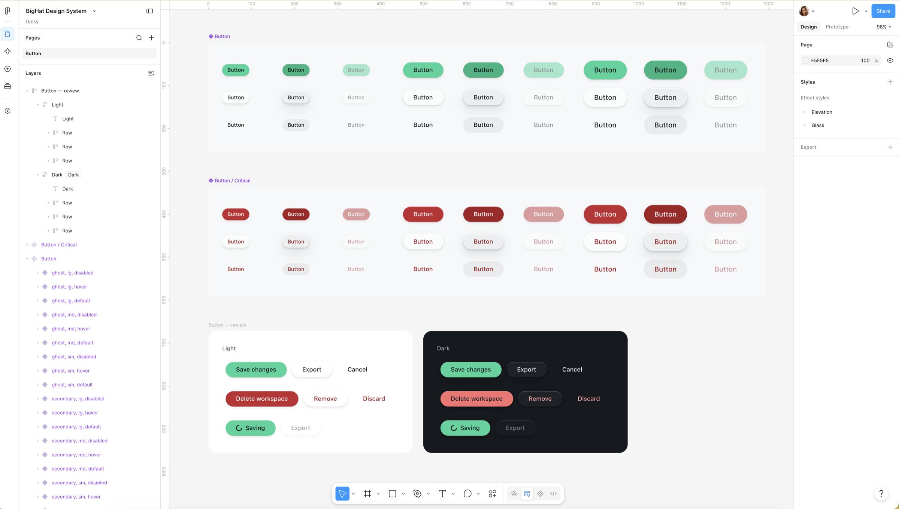

# [Big Hat — React](https://konstancja-tanjga.github.io/bighat-design-system/)

**[Open the Storybook →](https://konstancja-tanjga.github.io/bighat-design-system/)**

A design system built to answer the question interviews actually ask: not
"can you make a button", but *what did you decide, and what did it cost*.

Forty-five components. Two token layers, one of which is an API. Eight classes
of value that cannot be written as a literal anywhere in the library. WCAG AA
enforced by a failing build rather than a review comment.

The Storybook is the artefact — the case study, the foundations, the ARIA
conformance report and the token drift report are all pages in it, and the
reports are generated from the same audits that gate CI. This file is just the
front door.

There is a sibling: **[Big Hat — Angular](https://github.com/Konstancja-Tanjga/bighat-design-system-angular)**,
built from the same component contracts.

## In Figma

The tokens are also a Figma library, built from `tokens/*.tokens.json` rather
than redrawn: 224 variables in four collections — Primitives, Color (Light and
Dark), Size and Type. Every semantic variable carries its CSS name as code
syntax, so Dev Mode shows `var(--bh-action-primary-bg)`, not a hex, and the
primitives are hidden from every picker, as they are from product code. Button
is the first component in it: both tones, every size, the default, hover and
disabled states and a Loading toggle, bound to those variables, with a review
frame that switches the same instances to Dark by changing one mode.

Code stays the source of truth and the library follows it. Pressed and focus are
not drawn yet. Two things do not survive the trip: Figma cannot saturate a
backdrop, so the glass secondary button is a little flatter there than in a
browser, and the dark floating shadow keeps its light-theme geometry.



## Install

```bash
npm i @bighat/ui
```

```tsx
import '@bighat/ui/styles.css';
import { Button, StateBlock, ToastProvider } from '@bighat/ui';
```

## What is in here

| path | what |
| --- | --- |
| `tokens/*.tokens.json` | the DTCG 2025.10 source. Everything else is generated from it |
| `src/components/` | 45 components, one directory each |
| `src/styles/` | 49 stylesheets. `bh-*` classes, container queries, tokens only |
| `spec/components/` | one machine-readable contract per component |
| `agent/` | rules a coding agent can follow instead of inventing its own |
| `agent/REQUESTS.md` | the questions that are not a handoff: spacing, "the system cannot do this", whether something should become a component |
| `docs/` | the Storybook's own pages |
| `scripts/` | the gates, the audits, and every codemod that produced this version |

## The gates

```bash
npm run verify
```

| script | fails when |
| --- | --- |
| `tokens:check` | a committed token artefact drifted from the DTCG source |
| `spec:validate` | a contract leaks a framework type, breaks the prop vocabulary, or a component ships against an unfinished contract |
| `audit:drift` | a literal appears where a token belongs, in any of eight value classes |
| `aria` | a component's contract misses a key or attribute its APG pattern requires |
| `docs:check` | the published conformance page claims numbers the build does not produce |
| `test` | contrast (26 pairs × 2 themes), or a contract's keyboard map against the implementation |
| `check:docs` | a component has no story, no doc, or an unfinished scaffold |

The last one is currently red, on purpose: nine frame components have generated
stories and docs whose prose is unwritten. An invisibly incomplete library is
worse than a visibly incomplete one.

## Scripts that produced 4.0

Each takes a source path and has a `--dry` mode that prints every edit first.

| script | what it did |
| --- | --- |
| `codemod-tokens.mjs` | rewrote 132 literals that already equalled a token's value |
| `apply-decisions.mjs` | applied the 56 off-scale decisions in `DECISIONS-4.0.md` |
| `rename-stories.mjs` | aligned 14 Storybook titles with their export names |
| `apply-vocabulary.mjs` | replaced local prop unions with the shared vocabulary |
| `extract-contract.mjs` | filled anatomy, states, roles and tokens for 37 contracts from the source |
| `scaffold-docs.mjs` | generated stories and docs for the 9 undocumented components |

## Licence

MIT.
