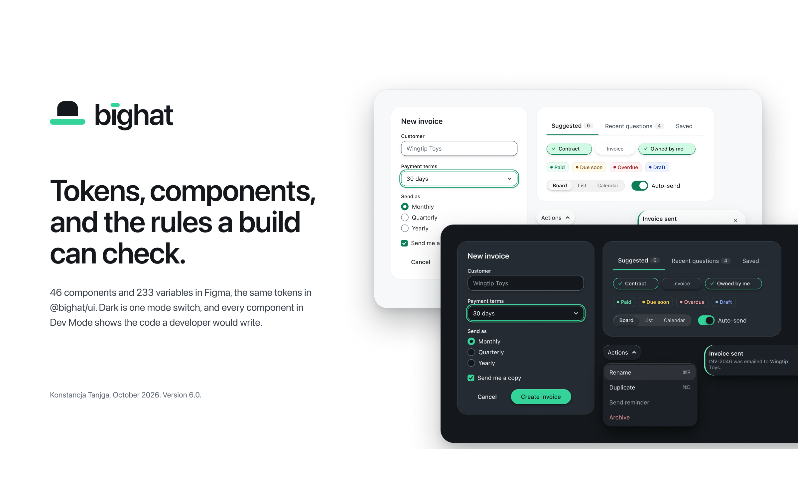
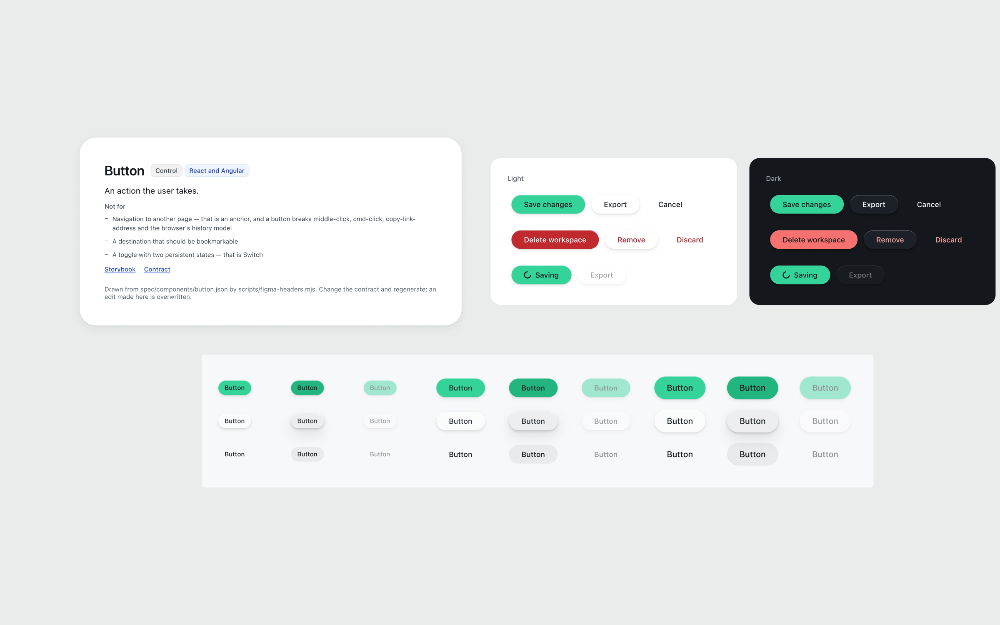
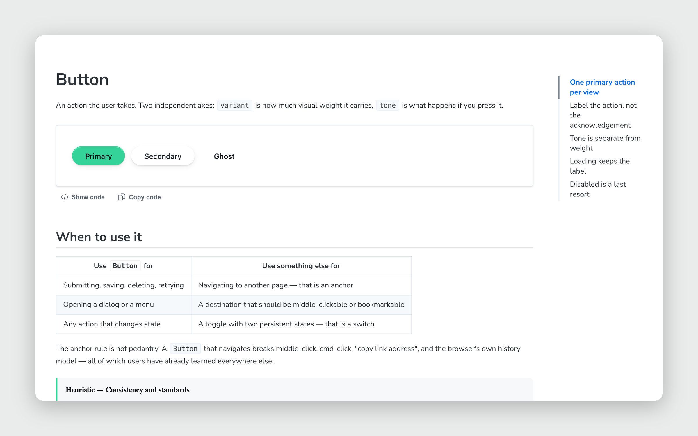
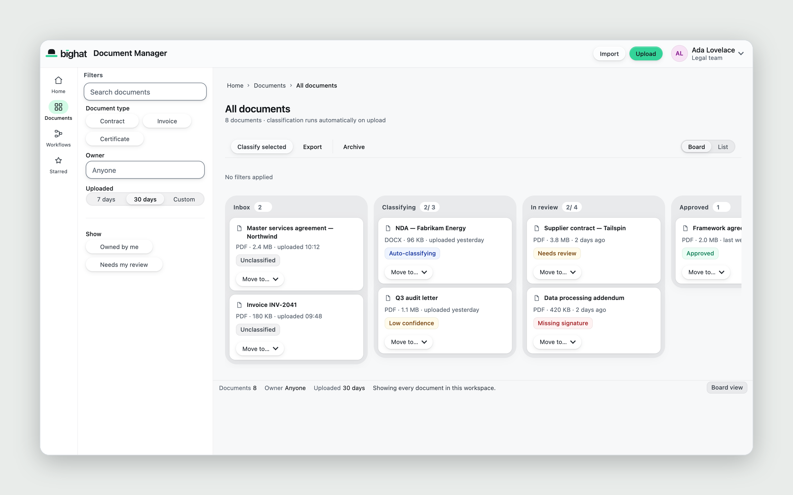
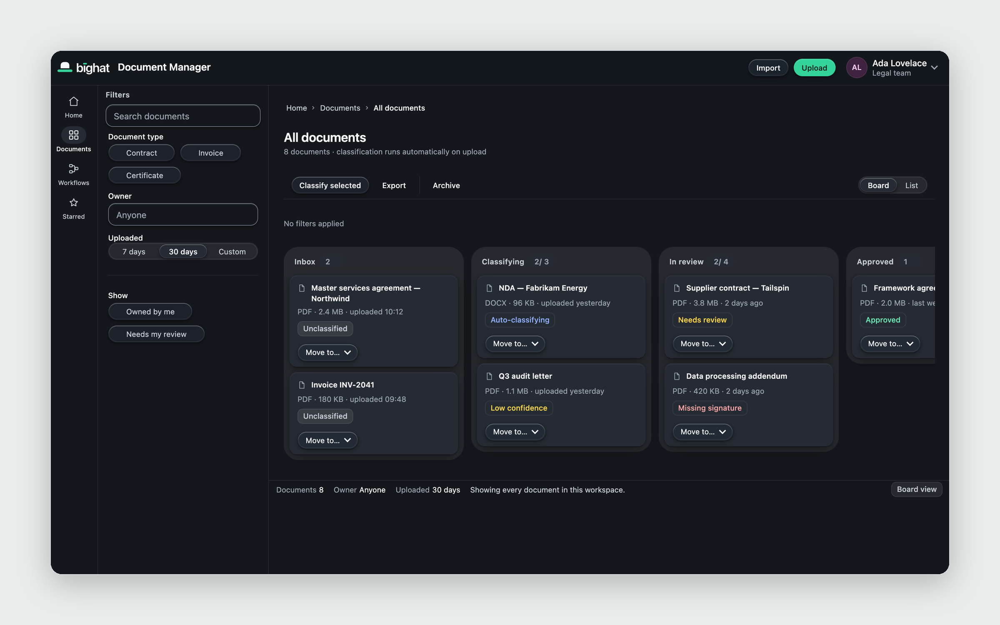
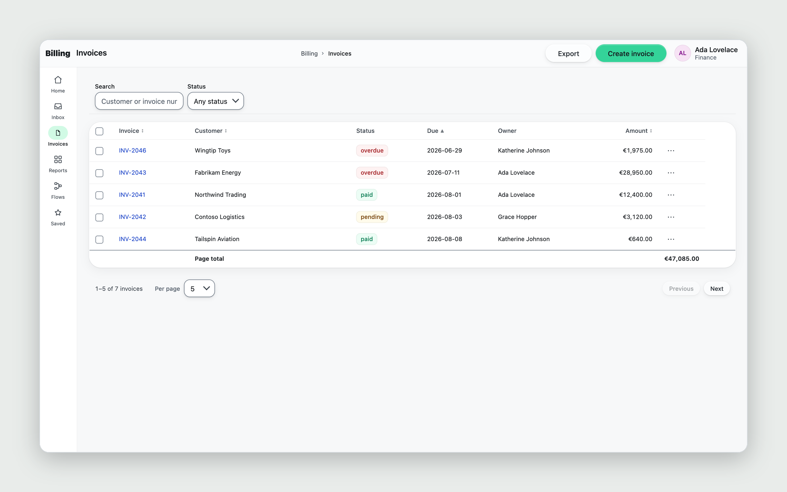
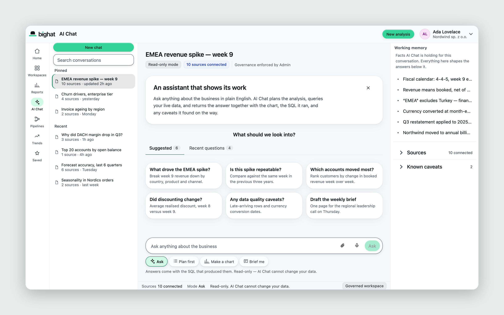
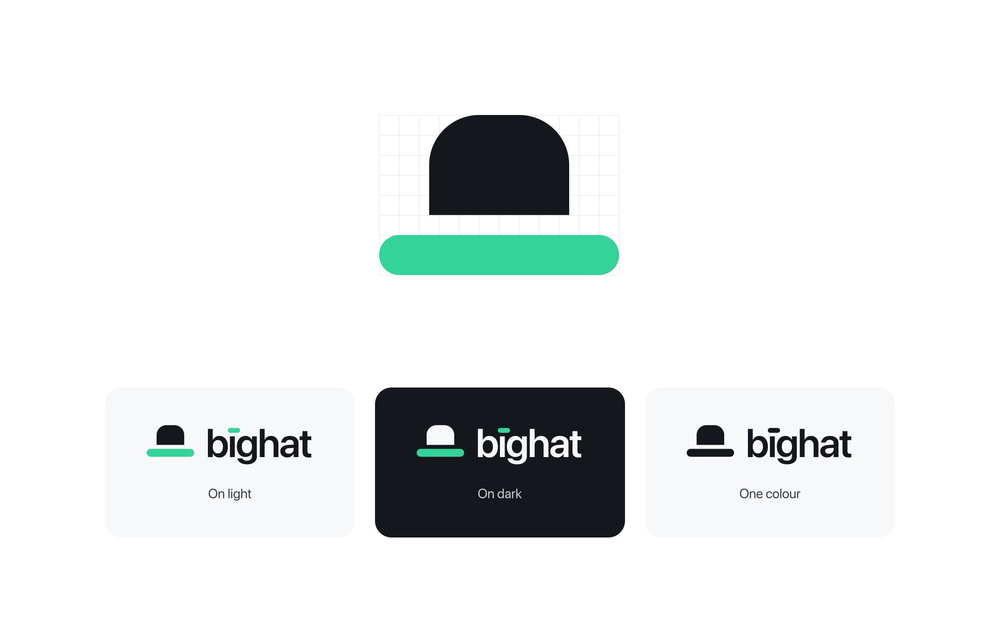

<a href="https://konstancja-tanjga.github.io/bighat-design-system/">
  <picture>
    <source media="(prefers-color-scheme: dark)" srcset="docs/brand/logo-dark.svg" />
    
  </picture>
</a>

# [Big Hat — React](https://konstancja-tanjga.github.io/bighat-design-system/)

**[Open the Storybook →](https://konstancja-tanjga.github.io/bighat-design-system/)**

A design system built to answer the question interviews actually ask: not
"can you make a button", but _what did you decide, and what did it cost_.

Forty-six components. Two token layers, one of which is an API. Eight classes
of value that cannot be written as a literal anywhere in the library. WCAG AA
enforced by a failing build rather than a review comment.

The Storybook is the artefact — the case study, the foundations, the ARIA
conformance report and the token drift report are all pages in it, and the
reports are generated from the same audits that gate CI. This file is just the
front door.

There is a sibling: **[Big Hat — Angular](https://github.com/Konstancja-Tanjga/bighat-design-system-angular)**,
built from the same component contracts.



## In Figma

The tokens are also a Figma library, built from `tokens/*.tokens.json` rather
than redrawn: 233 variables in four collections — Primitives, Color (Light and
Dark), Size and Type. Every semantic variable carries its CSS name as code
syntax, so Dev Mode shows `var(--bh-action-primary-bg)`, not a hex, and the
primitives are hidden from every picker, as they are from product code. A
Foundations page shows the primitives and the colour roles in both modes.

Every component in the package is in the library — all 46, from Button (both
tones) to AppShell — with a set of template icons, every value bound to those
variables, variant properties named after the props, and each with a review
frame that switches the same instances to Dark by changing one mode. Code
Connect templates in [`figma/`](figma/) make Dev Mode show the component a
developer would write.

Code stays the source of truth and the library follows it. Pressed states are
not drawn; the browser draws them. Two things do not survive the trip: Figma
cannot saturate a backdrop, so glass is a little flatter there than in a
browser, and the dark floating shadow keeps its light-theme geometry.

Each component page opens with a header drawn from its contract — purpose,
what it is not for, where it is implemented, links to Storybook and the
contract — regenerated by `npm run figma:headers`, never typed in Figma.



## In Storybook

Every component has a docs page that says when to use it and what to use
instead, with each do and don't rendered live and given its reason. Each page
has a Design tab that shows the component's Figma set.



## Templates

Screens assembled only from library components, each with its loading and
error states as stories, and an empty one where the screen can be empty.

|                                                                                                                                        |                                                                                                                                            |
| -------------------------------------------------------------------------------------------------------------------------------------- | ------------------------------------------------------------------------------------------------------------------------------------------ |
|  |                                                                     |
|       |  |

## The logo

The crown is the primitives — there, but never touched. The brim is the
semantic layer: wider than what is under it, and the only layer a product may
use. The dot on the i is the brim again. The files are in
[`docs/brand/`](docs/brand/); the colours are `text.primary` and
`action.primary.bg`, so the logo follows the theme like any component.



## Install

```bash
npm i @bighat/ui
```

```tsx
import '@bighat/ui/styles.css';
import { Button, StateBlock, ToastProvider } from '@bighat/ui';
```

## What is in here

| path                   | what                                                                                                                    |
| ---------------------- | ----------------------------------------------------------------------------------------------------------------------- |
| `tokens/*.tokens.json` | the DTCG 2025.10 source. Everything else is generated from it                                                           |
| `src/components/`      | 46 components, one directory each                                                                                       |
| `src/styles/`          | 49 stylesheets. `bh-*` classes, container queries, tokens only                                                          |
| `spec/components/`     | one machine-readable contract per component                                                                             |
| `agent/`               | rules a coding agent can follow instead of inventing its own                                                            |
| `agent/REQUESTS.md`    | the questions that are not a handoff: spacing, "the system cannot do this", whether something should become a component |
| `docs/`                | the Storybook's own pages                                                                                               |
| `scripts/`             | the gates, the audits, and every codemod that produced this version                                                     |

## The gates

```bash
npm run verify
```

| script          | fails when                                                                                                         |
| --------------- | ------------------------------------------------------------------------------------------------------------------ |
| `tokens:check`  | a committed token artefact drifted from the DTCG source                                                            |
| `spec:validate` | a contract leaks a framework type, breaks the prop vocabulary, or a component ships against an unfinished contract |
| `audit:drift`   | a literal appears where a token belongs, in any of eight value classes                                             |
| `aria`          | a component's contract misses a key or attribute its APG pattern requires                                          |
| `docs:check`    | the published conformance page claims numbers the build does not produce                                           |
| `test`          | contrast (26 pairs × 2 themes), or a contract's keyboard map against the implementation                            |
| `check:docs`    | a component has no story, no doc, or an unfinished scaffold                                                        |

The last one is currently red, on purpose: nine frame components have generated
stories and docs whose prose is unwritten. An invisibly incomplete library is
worse than a visibly incomplete one.

## Scripts that produced 4.0

Each takes a source path and has a `--dry` mode that prints every edit first.

| script                 | what it did                                                               |
| ---------------------- | ------------------------------------------------------------------------- |
| `codemod-tokens.mjs`   | rewrote 132 literals that already equalled a token's value                |
| `apply-decisions.mjs`  | applied the 56 off-scale decisions in `DECISIONS-4.0.md`                  |
| `rename-stories.mjs`   | aligned 14 Storybook titles with their export names                       |
| `apply-vocabulary.mjs` | replaced local prop unions with the shared vocabulary                     |
| `extract-contract.mjs` | filled anatomy, states, roles and tokens for 37 contracts from the source |
| `scaffold-docs.mjs`    | generated stories and docs for the 9 undocumented components              |

## Licence

MIT.
